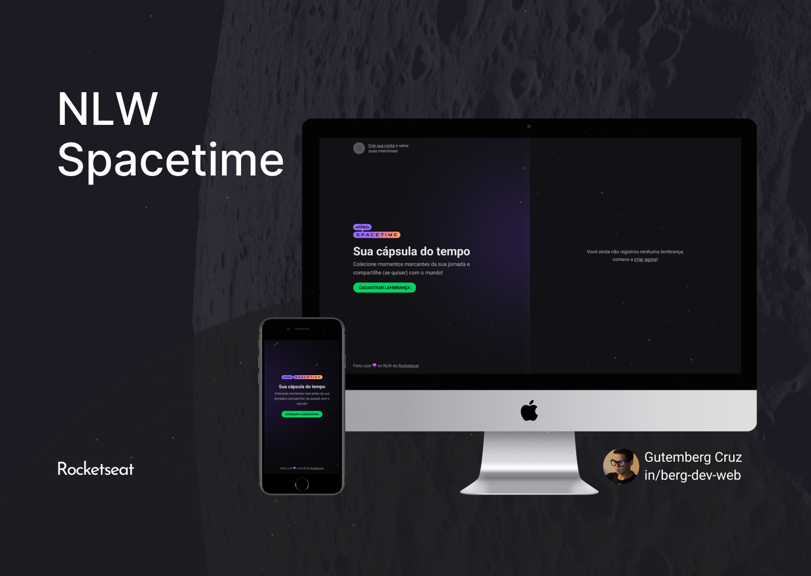

<h1 align="center">
    
</h1>

<h4 align="center">
  🚀 Next Level Week
</h4>

 

  

## :rocket: Technologies

This project was developed with the following technologies:

- [React](https://reactjs.org)
- [Next.js](https://nextjs.org/)
- [Node.js](https://nodejs.org/en/)
- [React Native](https://reactnative.dev/)
- [Expo](https://expo.io/)
- [Typescript](https://www.typescriptlang.org/)
- [Tailwind](https://tailwindcss.com/)
- [Prisma](https://www.prisma.io/)
- [Fastify](https://www.fastify.io/)

## 💻 Project

Developed at Next Level Week # 12, Spacetime is a time capsule where the user can store their memories in a timeline, so they can later access it and the application will provide the date, event, photo, and corresponding text of the selected memory.
